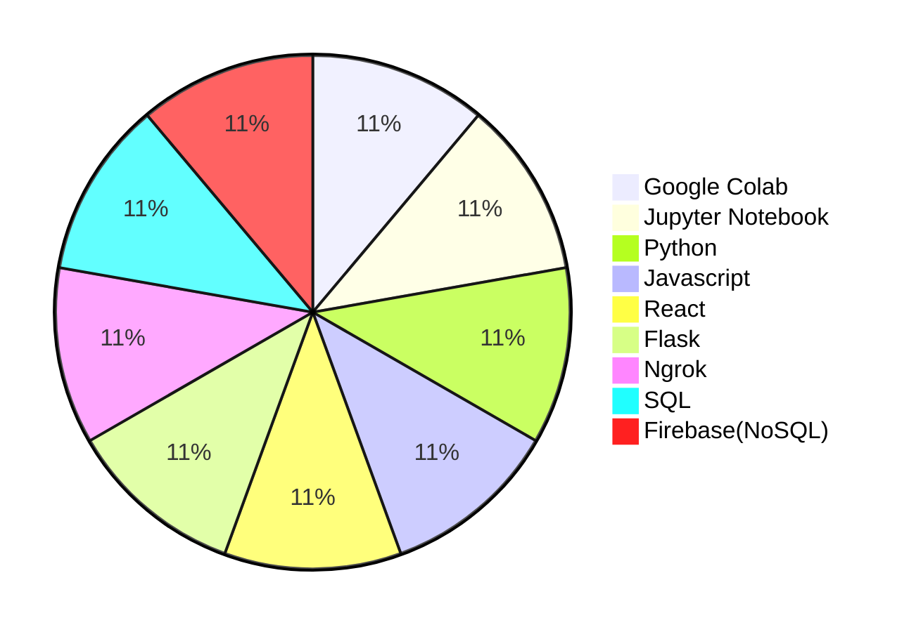

## Hello World 🌎
<div style="display: inline_block" align="center"><br>
  
  
  
  
  
  
  
  
</div>

### Me Chamo Saulo Candeira estudante de Ciência da Computação 

Sempre disposto aprender e encarar novos desafios junto com a tecnologia.

### Sobre mim

 📝 Atualmente tenho estudado sobre as seguintes tecnologias : Blockchain, Automação, Inteligencia Artificial, Banco de Dados e Desenvolvimento de Web e APP.
 
 🎈Para saber mais sobre mim e meus projetos, visite o website: [Saulo Candeira](https://saulocandeira.github.io/founder/) 

 💻 Apaixonado pelo mercado financeiro e tecnologia, estou desenvolvendo uma plataforma para unir empreendedores e start-ups, um game NFT integrado a uma plataforma EAD de Finanças & Tecnologia: [IHK](https://saulocandeira.github.io/Institute/) 

 🚩 Sou formado na area de Tecnico em Contabilidade & Tecnologo em Gestão de Negócios Imobiliarios, e agora em Analise e Desenvolvimento de Sistmmas, na area da tecnologia para unir inovações ao mundo do empreendedorismo.
 


###  Competências trabalhadas: 
 
📝 Desenvolvimento Web e APP

💡 Networking e Coworking

💼 Gestão de projeto 

🚀 Lançamentos de Projetos

💬 Comunicação

📖 Aprendizagem autodirigida

🤓 Autoconhecimento

### Habilidades técnicas:

<!--START_SECTION:waka-->
```text
Google Colab      ██████████████████░░░░░░░ 
Jupyter Notebook  ██████████████████░░░░░░░
Python            ██████████████████░░░░░░░ 
Javascript        ██████████████████░░░░░░░
React             ███████████░░░░░░░░░░░░░░
Flask             ███████████░░░░░░░░░░░░░░
Ngrok             ███████████░░░░░░░░░░░░░░ 
SQL               ███████████░░░░░░░░░░░░░░ 
FireBase(NoSQL)   ███████████░░░░░░░░░░░░░░ 
```




### Interesses em programação :

💻 Blockchain | Scrum | Python | Javascript | SQL | Java | Web Developer | Datascience | Front-End | Back-end | Fullstack | Devops

### Status :
<div align="center">
  <a href="https://github.com/saulocandeira">
  
  
</div>
  
<div align="center"> 
  <a href="https://www.youtube.com/channel/UChP6kSt8gVT92irS_UeoGEw" target="_blank"></a>
  <a href="https://instagram.com/saulocandeira" target="_blank"></a>
  <a href = "mailto:saulolsc@gmail.com"></a>
  <a href="https://www.linkedin.com/in/saulocandeira" target="_blank"></a> 
</div>
 
